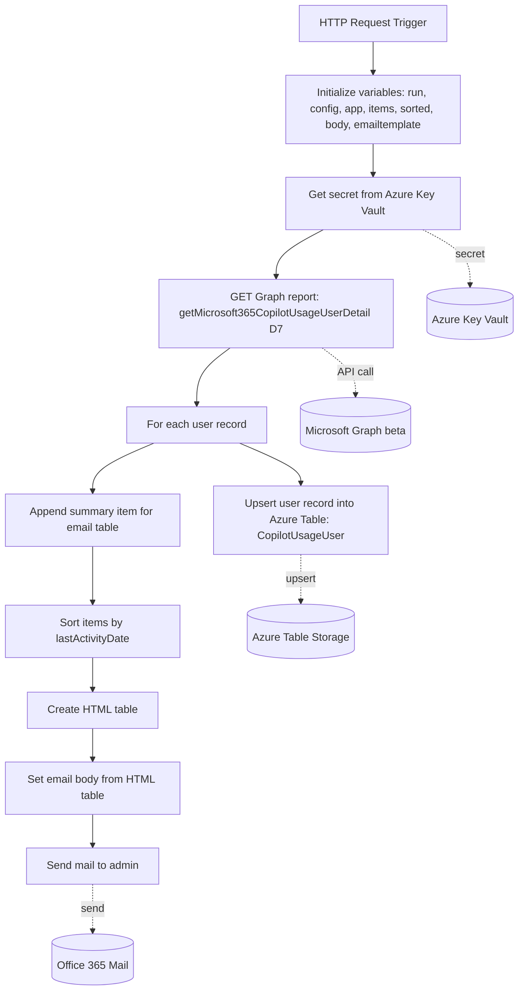

# 01-CopilotUsageUser Logic App Diagram

```mermaid
flowchart TB
  T[HTTP Request Trigger]
  I[Initialize variables: run, config, app, items, sorted, body, emailtemplate]
  K[Get secret from Azure Key Vault]
  G[GET Graph report: getMicrosoft365CopilotUsageUserDetail D7]
  F[For each user record]
  U[Upsert user record into Azure Table: CopilotUsageUser]
  A[Append summary item for email table]
  S[Sort items by lastActivityDate]
  H[Create HTML table]
  B[Set email body from HTML table]
  M[Send mail to admin]

  KV[(Azure Key Vault)]
  GRAPH[(Microsoft Graph beta)]
  TABLES[(Azure Table Storage)]
  O365[(Office 365 Mail)]

  T --> I --> K --> G --> F
  F --> U
  F --> A
  A --> S --> H --> B --> M

  K -. secret .-> KV
  G -. API call .-> GRAPH
  U -. upsert .-> TABLES
  M -. send .-> O365
```
