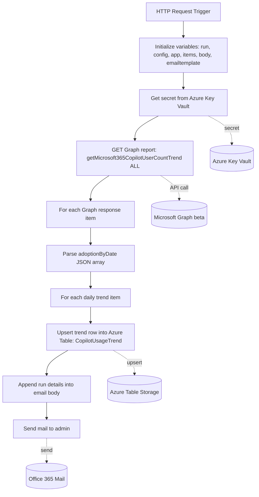

# 02-CopilotUsageTrend Logic App Diagram

```mermaid
flowchart TB
  T[HTTP Request Trigger]
  I[Initialize variables: run, config, app, items, body, emailtemplate]
  K[Get secret from Azure Key Vault]
  G[GET Graph report: getMicrosoft365CopilotUserCountTrend ALL]
  F1[For each Graph response item]
  P[Parse adoptionByDate JSON array]
  F2[For each daily trend item]
  U[Upsert trend row into Azure Table: CopilotUsageTrend]
  AB[Append run details into email body]
  M[Send mail to admin]

  KV[(Azure Key Vault)]
  GRAPH[(Microsoft Graph beta)]
  TABLES[(Azure Table Storage)]
  O365[(Office 365 Mail)]

  T --> I --> K --> G --> F1 --> P --> F2 --> U
  U --> AB --> M

  K -. secret .-> KV
  G -. API call .-> GRAPH
  U -. upsert .-> TABLES
  M -. send .-> O365
```
