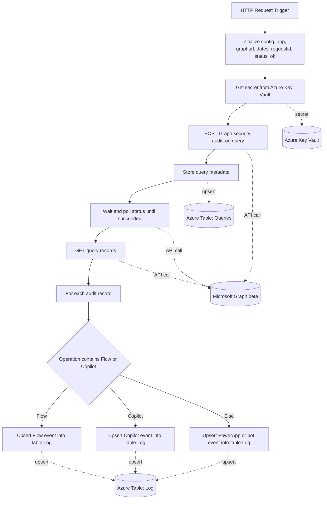

# 03-QueryAuditLog Logic App Diagram

```mermaid
flowchart TB
  T[HTTP Request Trigger]
  I[Initialize config, app, graphurl, dates, requestid, status, ok]
  K[Get secret from Azure Key Vault]
  Q[POST Graph security auditLog query]
  QR[Store query metadata]
  W[Wait and poll status until succeeded]
  D[GET query records]
  F[For each audit record]
  C{Operation contains Flow or Copilot}
  LF[Upsert Flow event into table Log]
  LC[Upsert Copilot event into table Log]
  LP[Upsert PowerApp or bot event into table Log]

  KV[(Azure Key Vault)]
  GRAPH[(Microsoft Graph beta)]
  QTABLE[(Azure Table: Queries)]
  LTABLE[(Azure Table: Log)]

  T --> I --> K --> Q --> QR --> W --> D --> F --> C
  C -->|Flow| LF
  C -->|Copilot| LC
  C -->|Else| LP

  K -. secret .-> KV
  Q -. API call .-> GRAPH
  W -. API call .-> GRAPH
  D -. API call .-> GRAPH
  QR -. upsert .-> QTABLE
  LF -. upsert .-> LTABLE
  LC -. upsert .-> LTABLE
  LP -. upsert .-> LTABLE
```
